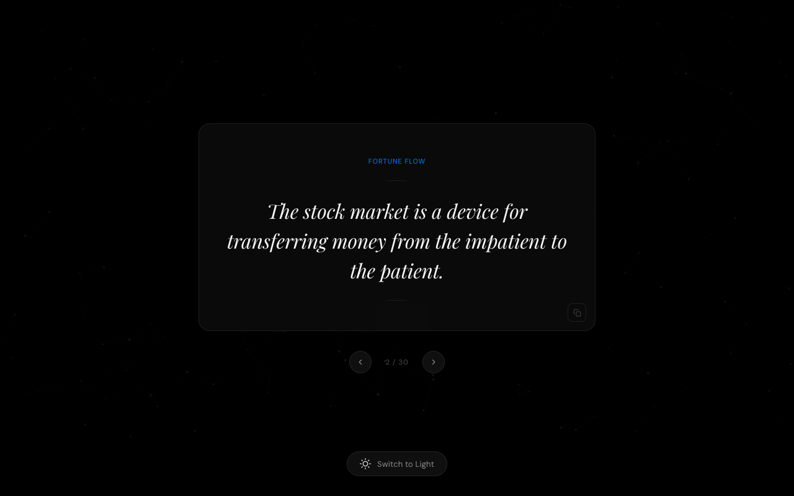

# Fortune Flow — Financial Wisdom

A minimal, single-page app that displays curated financial and motivational quotes in an Apple-inspired dark/light interface with an interactive particle field background.



## Features

- **30 curated quotes** on wealth, investing, discipline, and financial freedom
- **Quote navigation** — step through all quotes with Prev / Next buttons; a `2 / 30` counter tracks your position
- **Copy to clipboard** — one-click copy of the current quote via the clipboard icon on the card
- **Keyboard shortcuts** — `Space` or `→` for next quote, `←` for previous
- **Dark / Light theme** — toggles instantly and persists across sessions via `localStorage`
- **Interactive particle field** — 160 particles that react to cursor movement
- **Cursor glow** — subtle radial highlight that follows the mouse

## Usage

Open `index.html` directly in any modern browser — no build step or server required.

```bash
open index.html
```

Or serve it locally:

```bash
npx serve .
```

## Keyboard shortcuts

| Key | Action |
|-----|--------|
| `Space` | Next quote |
| `→` | Next quote |
| `←` | Previous quote |

## Tech stack

Pure HTML, CSS, and vanilla JavaScript. No frameworks, no dependencies, no build tools.
